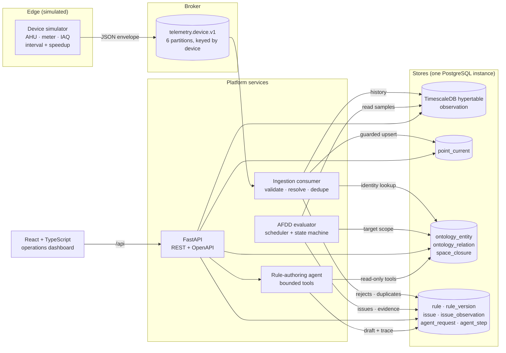
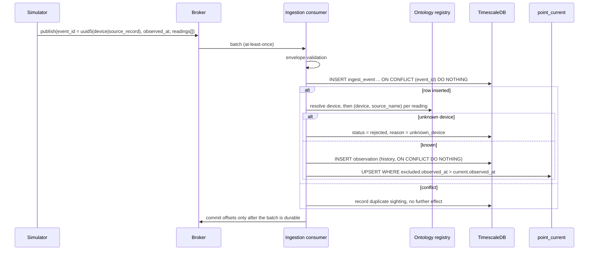
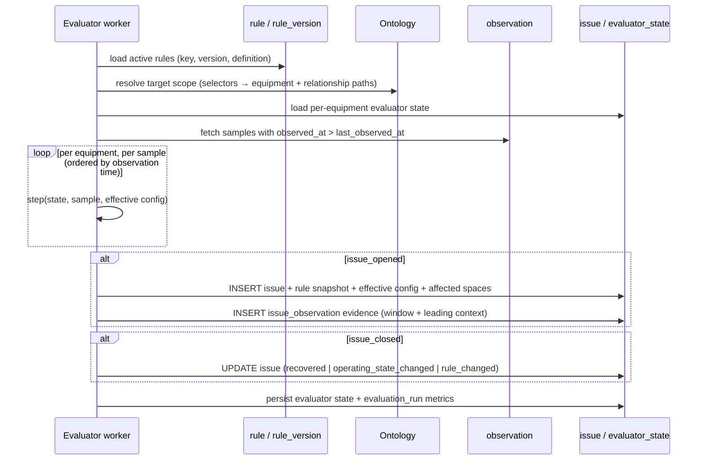
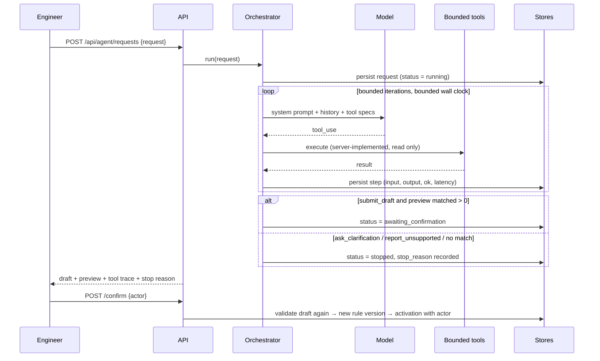

# System architecture

## Components

Every Python service runs from the same image; the compose command selects the
process. That removes the most common source of production drift, where the
worker and the API disagree about the version of the evaluation code.

## Trust boundaries

| Boundary | What crosses it | Control |
|---|---|---|
| Device → broker | Unauthenticated device claims: an id, a timestamp, values | Nothing is trusted. Identity is resolved against the ontology; unknown devices and points are rejected and counted. |
| Broker → platform | At-least-once delivery, possible replays and out-of-order arrival | Derived event ids + a primary-key claim make redelivery a no-op. Order is not assumed anywhere. |
| Model → platform | A proposed rule draft, possibly wrong or invented | The model can only call bounded read-only tools. Every draft is re-validated server-side. The agent cannot write a rule or activate one. |
| Operator → platform | Rule edits and activations | Versions are immutable and append-only; activation is a recorded action with an actor. |

The model is on the far side of the same boundary as a device: it is a source of
claims, not a source of authority.

## Telemetry ingestion flow

Offsets are committed after the write, so a crash replays the batch. The replay
is harmless because the identity claim happens inside the same transaction as
the effect.

## AFDD evaluation flow

## Natural-language rule flow

The agent never reaches the activation path. Confirmation is a separate,
human-authenticated call, and it re-validates the draft rather than trusting
what was stored.

## Why these boundaries

- **Ingestion is separate from evaluation.** Ingestion must keep up with device
  throughput; evaluation is bursty and depends on rule count. Separating them
  means a slow rule cannot stall the data path.
- **The evaluator core is a pure function.** `evaluator/core.py` has no database,
  clock or I/O. Live evaluation, backtesting and the unit tests all drive the
  same function, so a test genuinely proves shipped behaviour.
- **The agent is a client of the platform, not a privileged component.** It uses
  the same scope resolver and the same validator as the API.

## Failure behaviour

| Failure | Behaviour |
|---|---|
| Broker unavailable | Simulator and consumer retry with backoff. No data is written, nothing is silently marked healthy; `/api/health/pipeline` shows the ingest lag growing. |
| Store write fails mid-batch | Transaction rolls back, offsets are not committed, batch is redelivered. Idempotent writes make the retry safe. |
| A rule fails to validate | The worker logs it and skips that rule; other rules keep evaluating. |
| A device stops reporting | Evaluation moves to `insufficient_data`, visible on the dashboard and in `/api/health/pipeline`; no issue is opened or closed on absent data. |
| Model provider errors | Retried twice, then the request stops with `stop_reason = provider_error`. Nothing is drafted or activated. |
| No API key configured | The agent falls back to a deterministic provider and says so in the response and the UI. |
