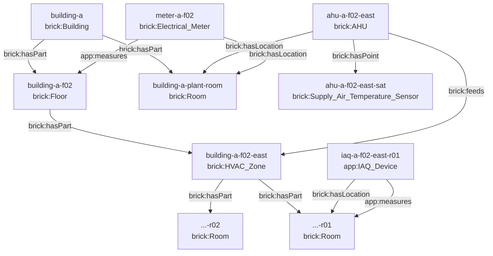

# Brickschema model

Brickschema version pinned: **1.3.0** (`https://brickschema.org/schema/1.3/Brick#`).
The vocabulary actually used is declared in one file,
[`afdd/ontology/brick.py`](../services/platform/afdd/ontology/brick.py), so the
boundary between the standard ontology and our own metadata is auditable rather
than implied.

## Entity classes

| Group | Source type | Class used | Notes |
|---|---|---|---|
| Spaces | Building | `brick:Building` | `property_type` (Office / Hotel) is application metadata on the entity |
| | Floor | `brick:Floor` | |
| | HVAC Zone | `brick:HVAC_Zone` | |
| | Room | `brick:Room` | Lobbies and plant rooms are rooms directly under the building |
| Equipment | AHU | `brick:AHU` | |
| | Electricity Meter | `brick:Electrical_Meter` | |
| | IAQ Sensor | `app:IAQ_Device` | See "Where we leave Brick" below |
| AHU points | RUN | `brick:Run_Status` | |
| | ALARM | `brick:Alarm` | |
| | SAT | `brick:Supply_Air_Temperature_Sensor` | |
| | RAT | `brick:Return_Air_Temperature_Sensor` | |
| | SAT_SP | `brick:Supply_Air_Temperature_Setpoint` | |
| Other points | POWER_KW | `brick:Electrical_Power_Sensor` | |
| | ENERGY_KWH | `brick:Electrical_Energy_Sensor` | |
| | ROOM_TEMP | `brick:Zone_Air_Temperature_Sensor` | |
| | RH | `brick:Humidity_Sensor` | |
| | CO2 | `brick:CO2_Sensor` | |

## Relationships



Every relationship is stored twice, in both directions
(`brick:hasPart` / `brick:isPartOf`, and so on), so neither traversal direction
needs a reverse scan.

### The distinction that matters most

An AHU's **installed location** and its **served space** are different facts and
are stored as different relationships:

- `ahu-a-f02-east brick:hasLocation building-a-plant-room` — where the unit is.
- `ahu-a-f02-east brick:feeds building-a-f02-east` — who it serves.

The affected scope of an issue is `feeds` → `hasPart` → rooms. The plant room is
returned alongside, explicitly labelled as not affected, so a technician is never
sent to the wrong room and a reviewer can see the distinction was made on
purpose.

## Where we leave Brick, and why

Three things are deliberately *not* dressed up as Brick:

1. **`app:IAQ_Device`.** Brick models the individual measurements
   (`brick:Zone_Air_Temperature_Sensor`, `brick:Humidity_Sensor`,
   `brick:CO2_Sensor`) and has no single class for a multi-sensor room device.
   Inventing one under the Brick namespace would be a lie about the standard, so
   the device sits in our namespace and its points stay pure Brick.

2. **`app:measures` / `app:isMeasuredBy`.** Brick has `brick:meters` /
   `brick:isMeteredBy`, defined for metering equipment. It fits the floor
   electricity meter but not the IAQ device, which *represents* a room without
   metering it. One honest application predicate beats stretching a Brick one
   across two different meanings. If a later Brick version adds a suitable
   relationship, the change is one line in `brick.py` plus a reload.

3. **Application metadata on entities**: `property_type`, `usage_type`,
   `expected_interval_seconds`, `value_type`, `unit`, and the `role` alias.
   These drive product behaviour (rule selectors, freshness, unit display) and
   are not semantic claims about the building.

### Point roles

Rules never name a site-specific point id or a raw source name. Each point
carries a stable **role** (`supply_air_temperature`, `run_status`, …) derived
from its Brick class. A rule asks for a role; the platform resolves it per
equipment through `brick:hasPoint`. That is what lets one rule apply across
three buildings whose naming conventions differ.

## Storage: relational, with a materialised closure

The ontology lives in PostgreSQL:

| Table | Purpose |
|---|---|
| `ontology_entity` | id, kind, Brick class, name, JSONB application metadata |
| `ontology_relation` | `(subject, predicate, object)` typed edges, both directions |
| `space_closure` | transitive `brick:hasPart` closure, `(ancestor, descendant, depth)` |
| `point_registry` | `(equipment_id, source_name) → point_id` resolution index |

Traversals of fixed shape (AHU → zone → rooms) are plain indexed joins. The
closure table is rebuilt by a single recursive CTE at load time and makes
"everything inside this building" a one-row-per-descendant lookup rather than a
recursive query per request.

**Why not a graph database.** The queries this product actually runs are
shallow, fixed-shape traversals over roughly 400 entities and 900 edges. A graph
database would add a second store to operate, back up, and keep consistent with
the issues and rules that must be joined to it in the same query. The relational
model keeps ontology, telemetry and issues transactionally consistent in one
place. The trade-off is real and stated in
[technical decisions](05-technical-decisions.md): if variable-depth traversal or
inference over the Brick class hierarchy becomes a product requirement,
`ontology_relation` maps onto Neo4j or Apache AGE without touching the callers,
because every traversal already goes through `ontology/queries.py`.

## Link to time-series identity

`point_registry.point_id` is the only identifier that reaches the telemetry
store. An incoming reading carries `(device_id, source_name)`, which is resolved
to a `point_id` before anything is written; an unresolved pair is rejected and
counted, never written under a guessed identity. Renaming a source point is
therefore an ontology change, not a data migration.

## Onboarding a new building or a changed ontology

Supply the same three source files and run:

```bash
docker compose run --rm seed afdd seed --source-dir /srv/source-pack
```

The loader is idempotent (`ON CONFLICT DO UPDATE`), rebuilds the closure, and
returns a report listing entity counts and every integrity problem it found —
an unknown parent space, equipment serving a space that does not exist, a point
owned by unknown equipment. Those are reported, not silently dropped.

What changes and what does not:

- **New building, same shape** — no code change. Rules that select by
  `property_types` pick it up on the next evaluation pass.
- **New equipment or point type** — add the class mapping and the role alias in
  `brick.py`. Rules can then require that role.
- **Changed relationships** — reload and the scope resolver produces a different
  matched set; the rule definition is untouched. Because target scope is
  evaluated on every pass, an ontology change shows up in the next rule preview.
- **Open issues** are not rewritten by an ontology change. They carry the
  affected zone and room ids recorded when they opened.
