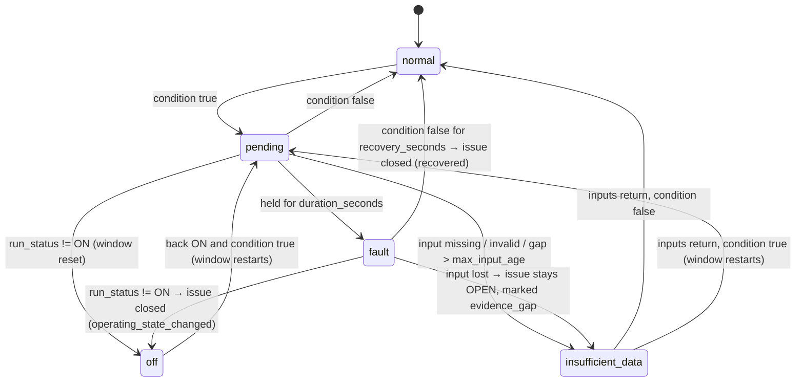
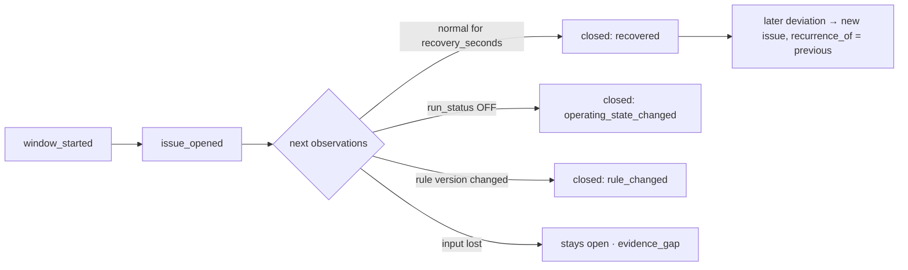

# AFDD behaviour

The required case, stated as the product implements it:

> For **office** properties, monitor **AHUs serving tenant areas**. While an AHU
> is **ON** and its required readings are **recent enough to trust**, open one
> **Critical** issue when supply-air temperature differs from its setpoint by
> more than **3 °C continuously for 15 minutes**.

None of those words exist as a code path. They are the seeded rule
[`ahu-supply-air-deviation`](../services/platform/afdd/rules/defaults.py).

## Rule schema

A rule has exactly two halves, stored separately, and either can change without
touching the other.

```yaml
key: ahu-supply-air-deviation
name: AHU supply-air temperature deviation
intent: <plain language, shown to the operator verbatim>

target:                       # WHICH entities
  include:
    property_types: [Office]
    equipment_classes: [brick:AHU]
    served_space_usage: [Tenant Area]
    served_floor_ids: null    # null = every tenant floor
  exclude_equipment_ids: []
  require_points:             # roles that must exist, or the asset is excluded
    - run_status
    - supply_air_temperature
    - supply_air_temperature_setpoint

logic:                        # HOW it is evaluated
  operating_state: {role: run_status, equals: ON}
  condition:
    left:  {role: supply_air_temperature}
    right: {role: supply_air_temperature_setpoint}
    operator: abs_difference_gt
    threshold: 3.0
    unit: degC
  duration_seconds: 900
  max_input_age_seconds: 180
  recovery_seconds: 300
  severity: Critical

overrides:                    # local settings, scoped
  - id: building-b-tighter-threshold
    scope: {property_ids: [building-b]}
    values: {threshold: 2.0}
```

### Extension points

| To add | Change | Rebuild needed |
|---|---|---|
| A new selector (e.g. `tenant_id`) | Declare it in `SELECTORS`, add its filter in `rules/scope.py` | No |
| A new datapoint | Add the Brick class and role in `ontology/brick.py`, reload | No |
| A new comparison | Add to `OPERATORS` and the two-line branch in `core._compare` | No |
| A new rule family | Write a definition; the evaluator is generic over operand, operator, gate and duration | No |

Two operand scopes exist today. `same_equipment` reads a point of the evaluated
asset. `served_zone_rooms` reads points from the devices in the zone the asset
feeds, reduced by `mean`/`max`/`min` — which is how the second shipped rule,
`ahu-return-vs-room`, compares return-air temperature against the rooms the AHU
actually serves. That rule ships as a **draft**, not activated, so the
cross-entity capability is demonstrable without changing the seeded outcomes.

### Overrides

Overrides carry a scope (`property_ids`, `served_floor_ids`, `equipment_ids`)
and the values they replace. Resolution happens per equipment at evaluation
time; the last matching override wins, and every issue records both the value
applied and its source (`rule_default` or `override:<id>`). An override changes
nothing outside its scope — proven by
`test_override_applies_only_inside_its_scope` and
`test_override_does_not_change_other_equipment`.

## Timing semantics

The window advances on **device-recorded observation time**, never on platform
receipt time.



### The decisions, and why

| Question | Decision | Why |
|---|---|---|
| How recent must an input be? | `max_input_age_seconds = 180`, three expected 60-second intervals | Tolerates one dropped reading without tolerating a dead feed. Configurable per rule. |
| What happens to an in-progress window when the AHU turns OFF? | Window **resets**; an open issue **closes** with `operating_state_changed` | A unit that is not running is not running badly. Carrying the timer across a stop would let a stopped unit accumulate evidence it never produced. |
| Absent, blank, invalid or too-old input? | State becomes `insufficient_data`; window resets; **no issue opens** | The rule is about a proven 15 continuous minutes. Guessing across a hole is how AFDD products lose engineers' trust. |
| ...and if an issue is already open? | It stays **open**, flagged `data_quality = evidence_gap` | Losing sight of a fault is not the fault clearing. Closing it would silently hide an unresolved problem. |
| Can a gap be bridged? | No. A gap longer than `max_input_age_seconds` resets the window | Proven by `test_a_gap_longer_than_max_input_age_breaks_the_window`. |
| How does an issue recover? | Condition false continuously for `recovery_seconds = 300` → closed, reason `recovered` | A single normal sample is noise; five minutes is a state change. |
| How is a later recurrence represented? | A **new** issue with `recurrence_of` pointing at the previous one and an incremented `recurrence_index` | Reopening would destroy the first occurrence's duration and evidence. |
| What if the rule changes while an issue is open? | The open issue closes with reason `rule_changed`, keeping its original version; evaluation restarts under the new version | The issue's evidence was gathered under rules that no longer apply. Silently re-basing it would make the audit trail false. |
| What does an issue remember? | Full `rule_snapshot` (the definition as it was), `effective_config` after overrides, threshold source, evidence observations, affected zone and rooms | An issue must be explainable months later, after the rule has moved on. |

### Timing worked through, on the supplied fixture

`ahu-a-f02-east`, 4.4 °C deviation, AHU ON:

| Observation time | Condition | Window | Action |
|---|---|---|---|
| 10:00 | true | starts | `window_started` |
| 10:01 … 10:14 | true | 60 s … 840 s | accumulating (`pending`) |
| **10:15** | true | **900 s ≥ 900** | **`issue_opened`**, `opened_at = 10:15`, `trigger_started_at = 10:00` |
| 10:16 … 10:20 | true | — | issue open |
| 10:21 | false | reset | recovery timer starts |
| **10:26** | false | — | **`issue_closed`**, reason `recovered` |

## Issue lifecycle and evidence



Every issue stores:

- the opening rule **version** and a full snapshot of the definition,
- the **effective configuration** after overrides, with `threshold_source`,
- `trigger_started_at`, `trigger_observed_at`, `qualifying_seconds`,
- the **observations** in the window plus five minutes of leading context, each
  with supply-air temperature, setpoint, computed difference, run status and
  quality,
- `data_quality` (`good` or `evidence_gap`),
- the **affected zone and room ids** as resolved when it opened,
- the `installed_space_id`, kept separate and labelled not-affected,
- a lifecycle log of every state change.

## Determinism

`EVAL_CLOCK=data` (the default) sets evaluation time to the newest observation
time in the store. Replaying the six-hour fixture at any speed therefore
produces identical issues at identical observation timestamps. `EVAL_CLOCK=wall`
switches to wall-clock time for a live deployment.

`evaluator/core.py` is a pure state machine: no clock, no database, no I/O. The
worker, the backtester and the unit tests all call the same `step` function.
Evaluation is also **incremental and resumable** — per-equipment state is
persisted, and
`test_resuming_from_stored_state_matches_a_single_pass` proves a resumed run
produces the same transitions as a single pass.

## Supported limitations

Stated rather than hidden:

- One open issue per (rule, equipment) at a time, enforced by a partial unique
  index. A second concurrent fault mode on the same asset needs a second rule.
- Overrides adjust `threshold`, `duration_seconds` and `severity` only. They
  cannot change the target scope; that is a rule edit, and deliberately so.
- `served_zone_rooms` aggregates with `mean`/`max`/`min` over whatever rooms
  reported at that instant. It does not require every room to report.
- There is no suppression, scheduling or maintenance-window concept.
- Severity is static per rule; it does not escalate with duration.
- The evaluator is single-process. Scaling out is discussed in
  [technical decisions](05-technical-decisions.md).

## Verification

`services/platform/tests/` contains 48 tests, all of which run without a
database or broker.

| Required behaviour | Test |
|---|---|
| Normal data creates no issue | `test_normal_data_creates_no_issue` |
| Short deviation creates no issue | `test_deviation_shorter_than_duration_creates_no_issue`, `test_short_deviation_creates_no_issue` (fixture) |
| Sustained deviation opens one issue after the duration | `test_deviation_exactly_at_duration_opens_one_issue`, `test_sustained_deviation_opens_exactly_one_critical_issue` (fixture) |
| OFF cannot create a misleading issue | `test_deviation_while_off_never_opens_an_issue`, `test_turning_off_mid_window_resets_the_timer`, `test_deviation_while_off_creates_no_issue` (fixture) |
| Missing data cannot create a misleading issue | `test_missing_setpoint_suspends_evaluation_and_cannot_open_an_issue`, `test_missing_setpoint_is_visible_and_suspends_evaluation` (fixture) |
| Outdated data cannot create a misleading issue | `test_a_gap_longer_than_max_input_age_breaks_the_window`, `test_stale_feed_at_evaluation_time_reports_insufficient_data` |
| Recovery follows the documented lifecycle | `test_recovery_closes_the_issue_after_the_configured_normal_period`, `test_that_issue_recovers_five_minutes_after_readings_normalise` (fixture) |
| Recurrence follows the documented lifecycle | `test_recurrence_is_a_new_issue_not_a_reopen` |
| A local override changes its scope only | `test_the_same_series_triggers_under_a_tighter_override_threshold`, `test_override_applies_only_inside_its_scope`, `test_small_deviation_needs_the_local_override_to_trigger` (fixture) |
| Equipment missing a required point is excluded visibly | `test_logic_must_declare_the_points_it_reads` plus the `missing_required_point` exclusion reason in the rule preview (see the [demonstration guide](06-demonstration-guide.md)) |
