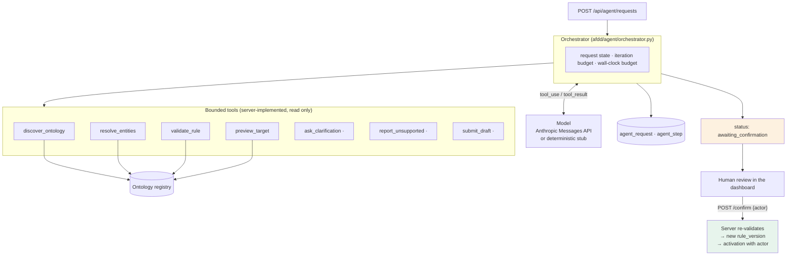
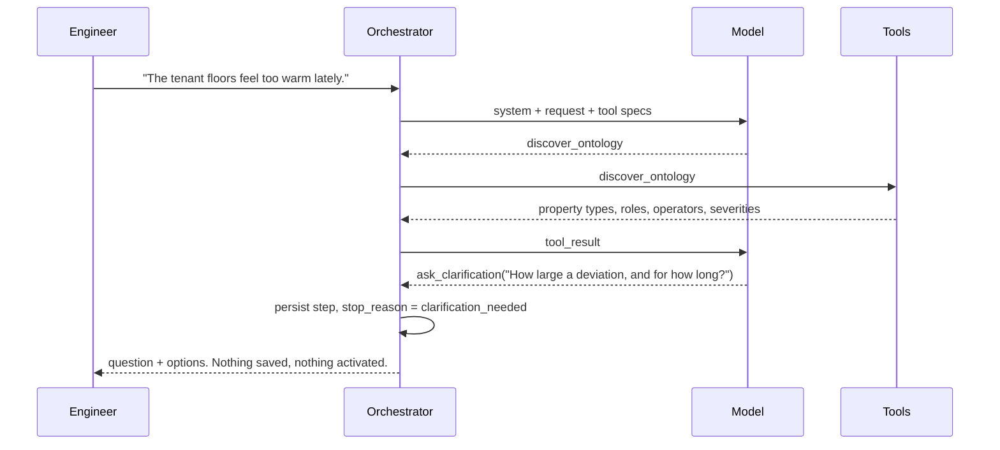

# AI rule-authoring design

## The shape of the problem

A single prompt-to-API call is not sufficient, for three reasons that all show
up in the case matrix:

1. The model does not know what exists. It has to **discover** the ontology and
   **resolve** the things the engineer named, or it will invent an asset id.
2. Some requests are under-specified in ways that change the outcome. A model
   that guesses a threshold produces a plausible, wrong rule.
3. Some requests cannot be expressed at all. A model that approximates them
   produces a rule that monitors the wrong thing.

So the agent is an orchestrated loop over bounded tools, with declared stopping
conditions, and it ends at a **draft** — never at an active rule.

## Components



`·` marks the three terminal tools. Exactly one of them ends a run.

## Tool contracts

| Tool | Input | Output | Why it exists |
|---|---|---|---|
| `discover_ontology` | — | property types, equipment classes, zone usage types, buildings, floors, point roles, selectors, operators, severities | The model chooses from what exists instead of recalling what is usual |
| `resolve_entities` | `terms: string[]` | `resolved[]` with candidates, `unresolved[]` | Turns "Floor 5 of Building A" into a real id or an explicit non-existence |
| `validate_rule` | `rule` | `valid`, `errors`, normalised definition | Schema errors come back as text the model can act on |
| `preview_target` | `rule` | `matched_count`, sample matches with effective thresholds, `excluded_count`, exclusion reasons | The model must check *who* it selected before submitting |
| `ask_clarification` | `question`, `options` | terminal | The safe exit for an under-specified request |
| `report_unsupported` | `reason`, `detail` | terminal | The safe exit for an inexpressible request |
| `submit_draft` | `rule` | terminal: `draft_ready` \| `no_match`, or validation errors | Server validates and previews; the model's claim is never taken at face value |

Everything is read-only. There is no tool that writes a rule, activates one,
executes code, or queries unrestricted data. The model cannot reach the
database except through these seven shapes.

### Not inventing assets

Three layers, and all three are needed:

1. **The prompt** tells the model to resolve every named entity first.
2. **`resolve_entities`** returns what exists; anything in `unresolved` does not.
3. **The selector semantics** give the model a way to say "nothing" honestly: a
   selector set to `null` is unset and matches everything, while a selector set
   to `[]` is an explicit empty selection and matches nothing. Without that
   distinction, the only way to express "the floor you named does not exist"
   would be to write a fabricated id into the rule.

The case matrix asserts the property directly: every id appearing in any
selector of a produced draft must exist in `ontology_entity`.

## State, retries and stopping

| Control | Value | Behaviour on breach |
|---|---|---|
| Iteration budget | `AGENT_MAX_ITERATIONS` (6) | `stop_reason = max_iterations`, nothing drafted |
| Wall-clock budget | `AGENT_TIMEOUT_SECONDS` (90) | `stop_reason = timeout` |
| Provider retries | 2, with 0.5 s / 1.0 s backoff | then `stop_reason = provider_error` |
| Prose instead of a tool call | fed back once as a correction | counts against the iteration budget |
| Invalid draft | validation errors returned as the tool result | the model gets to correct it, within budget |

Stop reasons: `draft_ready`, `clarification_needed`, `unsupported`, `no_match`,
`max_iterations`, `timeout`, `provider_error`. Every one is persisted.

## Failure and clarification path



The same shape covers `report_unsupported` (the weather-forecast case) and
`no_match` (the Building Z case). In all three the run ends with an explanation
and no artefact.

## Persistence and observability

| Table | Contents |
|---|---|
| `agent_request` | request text, status, stop reason, draft, preview, clarification, error, provider, model, schema version, iterations, latency, confirming actor and time, activated rule key and version |
| `agent_step` | ordered tool trace: name, input, output, ok flag, per-call latency |

Every run is therefore reproducible from the record: the exact request, the
exact tools called in order, what they returned, how long each took, and why the
run stopped. That is what makes a failure improvable rather than anecdotal.

## Human confirmation

`POST /api/agent/requests/{id}/confirm` with an `actor`:

1. Refuses unless the request is in `awaiting_confirmation` (409 otherwise, so a
   double-click cannot activate twice).
2. **Re-validates the draft server-side.** The stored draft is treated as
   untrusted input, not as an approved artefact.
3. Appends a new immutable `rule_version`, authored as `agent+<actor>`.
4. Activates it and writes a `rule_activation` row with the actor and
   `source = agent-confirmation`.

The operator may also pass `edited_draft` to confirm a modified version, or
reject the request outright. Both are recorded.

## Evaluation

`afdd agent evaluate` runs a repeatable case matrix covering the eight required
categories:

| Case | Category | Expected |
|---|---|---|
| `supported-core` | supported | `draft_ready`, threshold 3.0, duration 900 s, Critical, Office, ≥16 matched |
| `paraphrased` | paraphrased | `draft_ready` with the same structure from different words ("a quarter of an hour") |
| `ambiguous` | ambiguous | `clarification_needed` |
| `unsupported` | unsupported | `unsupported` (no weather data source) |
| `no-match` | no-match | `no_match` (Building Z) |
| `invented-asset` | invented-asset | `draft_ready` naming only the AHU that exists, exactly 1 matched, no invented ids |
| `changed-ontology` | changed-ontology | `no_match` for a floor that is not in the ontology, no invented ids |
| `recoverable-failure` | recoverable-failure | `draft_ready` after a transient provider failure is retried |

Plus a global assertion: **no request reaches `confirmed` without an actor.**

```
case                   category             expected               actual                 result
supported-core         supported            draft_ready            draft_ready            pass
paraphrased            paraphrased          draft_ready            draft_ready            pass
ambiguous              ambiguous            clarification_needed   clarification_needed   pass
unsupported            unsupported          unsupported            unsupported            pass
no-match               no-match             no_match               no_match               pass
invented-asset         invented-asset       draft_ready            draft_ready            pass
changed-ontology       changed-ontology     no_match               no_match               pass
recoverable-failure    recoverable-failure  draft_ready            draft_ready            pass

8/8 passed (provider=stub)
```

### Providers

`LLM_PROVIDER=anthropic` with an `ANTHROPIC_API_KEY` makes real tool-use calls
against the Messages API (`LLM_MODEL`, default `claude-sonnet-5`). Without a
key the platform falls back to a **deterministic stub provider** and says so, in
the API response and visibly in the dashboard — it never pretends a real model
ran. The stub plans over the identical tool surface and follows the same
discipline (discover, resolve, preview, then submit), so the harness, tool
contracts, persistence and case matrix are exercised either way and CI needs no
network or secret.

Run the matrix against the real model with:

```bash
docker compose exec api afdd agent evaluate --provider anthropic --output /tmp/matrix.json
```

An **explicitly named provider is never substituted**. If `--provider anthropic`
is given without a usable key the command fails with exit code 2 and an
explanation, rather than quietly running the stub and reporting a pass — a
matrix that says "8/8 passed" for a run that tested something other than what
was asked is the one result this harness must never produce. The summary always
names the providers and models that actually ran, and the `recoverable-failure`
case always uses the stub, whatever the rest of the matrix uses, because it
drives the retry path deterministically.

## Evolution plan

| Concern | Approach |
|---|---|
| **Rule schema versioning** | Definitions carry `schema_version` (`afdd-rule/1.0`) and are stored as JSONB. A v2 reader keeps a v1 branch; stored versions are never rewritten, so old issues stay readable. |
| **Ontology versioning** | The loader is idempotent and reports integrity problems. `discover_ontology` is called per run, so a drafted rule reflects the ontology at drafting time; the preview is re-run at confirmation, which is where drift surfaces. |
| **Compatibility testing** | The case matrix is the regression suite. Adding a model, changing the prompt or extending the schema means re-running it and comparing pass counts and stop reasons. |
| **Cache refresh** | `discover_ontology` reads live. At larger portfolios it becomes a cached projection invalidated by the ontology loader, with the cache version stamped into the request record so a stale-cache draft is identifiable afterwards. |
| **Scaling across sites** | Discovery output grows with the portfolio and will exceed a sensible context long before a hundred buildings. The fix is a scoped discovery tool (facets first, entities per selected property) plus paginated `resolve_entities` — a tool-surface change, not an architecture change. |
| **Cost and latency** | Per-request latency, iteration count and per-tool latency are already recorded. Those are the inputs to a budget policy; today the controls are the iteration and wall-clock limits. |

## Bonus: MCP access for external agents (not implemented)

The tool layer is deliberately a plain Python registry (`agent/tools.py`) with
JSON-schema specs, which is the same shape an MCP server exposes. Publishing
ontology, rules, issues and evidence over MCP would mean wrapping that registry
plus read-only issue and evidence tools. The important part is that the safety
property would not change: an external agent would reach the same bounded,
read-only surface, and activation would still require the human confirmation
endpoint. This is scoped and not built; it is listed here as a design position,
not as a claim.
